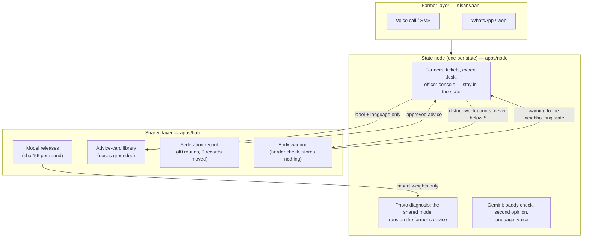
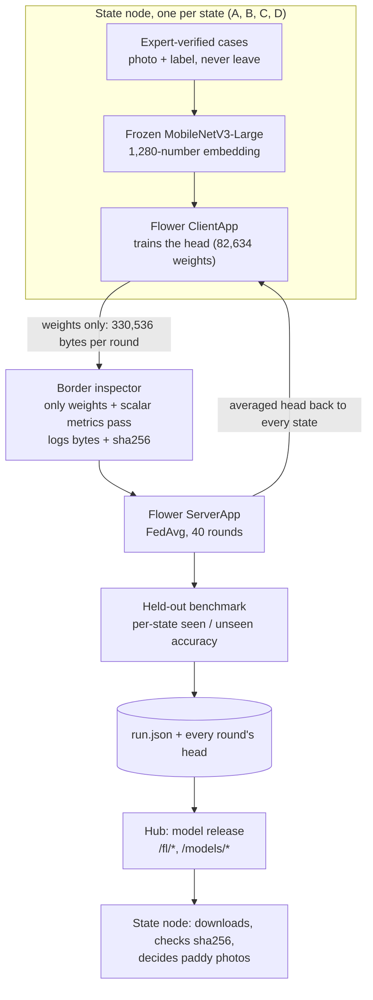

# Saajha (साझा)

**States share what they've learned — not who their farmers are.**

Saajha is a federated network for Indian agriculture. Each state runs its own **node**: farmers reach it by voice call, SMS, WhatsApp or the web in their own language, and the state's experts, tickets and records stay there. States share what they learn through a **shared layer**: a crop-disease model trained together by federated learning, expert-approved advice, and outbreak counts that warn a neighbouring state before a pest crosses the border. **One rule: raw farmer data never leaves its state.** Only models, counts and approved advice cross.

- **State nodes (farmer + officer app, same code, one per state):** Telangana https://saajha-node.vercel.app · Maharashtra https://saajha-node-mh.vercel.app — KisanVaani, the farmer layer
- **Shared layer (model releases, federation record, card library, early warning):** https://saajha-hub.vercel.app

Built for Build with AI: Code for Communities, Second Edition (Google Cloud × Hack2skill × GDG India), track **PS-04 Agricultural Intelligence**.

## Try it in three minutes

1. **A farmer's photo, decided by the shared model.** Open [saajha-node.vercel.app/demo](https://saajha-node.vercel.app/demo) → *Photo diagnosis* → tap a sample paddy photo. The node downloads the model the hub released (16.8 MB, once, fingerprint-checked), runs it **in your browser**, and the federated model decides. Gemini checks the photo shows paddy and gives a second opinion; on the rice-hispa sample it usually disagrees ("bacterial leaf blight, 85%"), which is shown and logged for an expert to audit. The advice comes from an approved card, in Hindi, IPM first, with a voice note.
2. **The learning loop: an expert's answer teaches every state.** On [saajha-node.vercel.app/demo](https://saajha-node.vercel.app/demo) → *Photo diagnosis* → *Try the learning loop*, send **photo 1**: the shared model is only 43% sure, so it goes to Telangana's expert. In [/command](https://saajha-node.vercel.app/command) → *Escalations*, open the case (the photo is stored in Telangana's own database), verify it as brown spot, and press **Run a federated round**: each state node trains on its newly verified cases and sends only weights; the hub releases round 41 only after checking it on held-out photos (84.5% → 84.6%). Send **photo 2**, a different photo of the same plant that round 40 misread as bacterial leaf blight: round 41 decides it, brown spot 78%, with advice. The round shows up in the [federation record](https://saajha-hub.vercel.app/federation#live-rounds).
3. **Early warning across a state border.** [saajha-hub.vercel.app/exchange](https://saajha-hub.vercel.app/exchange): the hub pulls two separately deployed state nodes, accepts only district-week outbreak counts of at least 5, and warns Telangana that pink bollworm is rising in Yavatmal (Maharashtra), across the Penganga river from Adilabad. Then *Test the border yourself*: try to send a farmer's phone number, a count of 3 or a person's name, and watch the hub refuse it without repeating it.
4. **The district officer's view.** [saajha-node.vercel.app/command](https://saajha-node.vercel.app/command): the warning from Maharashtra arrives with *Alert farmers in Adilabad*; Gemini writes the alert in Telugu and the officer reads it before sending. Weather alerts by block are live too (Gemini drafts those in the district's language the same way).
5. **A regenerative crop plan.** [saajha-node.vercel.app/recommend](https://saajha-node.vercel.app/recommend) → pick a district → every crop gets two scores (this season, and the soil over the next seasons) and the plot gets practices triggered by its own numbers: a pulse when nitrogen is low, green manure when carbon is low, water saving when rain is short.
6. **Proof of the federation.** [saajha-hub.vercel.app/federation](https://saajha-hub.vercel.app/federation) → *Verify all 40 rounds*: your browser recomputes the fingerprint of every round's weights. Farmer records moved: 0.
7. **Proof the node runs the shared model exactly.** [saajha-node.vercel.app/dev/model-check](https://saajha-node.vercel.app/dev/model-check) → *Run the model check*: 6 of 6 photos give the same image features as Python (cosine 1.000000) and the same answer.
8. **The same on WhatsApp.** [saajha-node.vercel.app/whatsapp](https://saajha-node.vercel.app/whatsapp) → send a photo or a voice note.

## How it fits together



**The decision rule** (`apps/node/lib/fed/decide.ts`, live):

| Photo | Who decides | What the farmer gets |
|---|---|---|
| Paddy, federated model ≥ 58% sure | **The federated model** | Advice from the approved card for that condition, in their language, IPM first, doses exactly as on the card, and a voice note. If Gemini's second opinion differs, the advice stands and the case is logged for expert audit. |
| Paddy, below 58% | **A state expert** | A ticket to the expert desk; no advice is guessed. |
| Another crop (no federated model yet) | **A state expert** | Gemini's reading marked **not yet verified**, safe first steps only (no pesticide, no dose), and an expert ticket. |
| Not a plant | — | A request for a clear crop photo. |
| Gemini or the model unavailable | **A state expert** | A ticket. Never a canned diagnosis. |

58% is the calibrated threshold at which at least 90% of the model's advice was right on held-out validation photos. Gemini does not decide paddy diagnoses because it is not reliable at telling these field conditions apart: on 50 held-out photos, `gemini-3.5-flash-lite` alone named the right condition **24%** of the time while stating about 92% confidence whether right or wrong; the federated model was right on **84%** of the same photos.

## Results

From recorded run **`deploy-h64-r40`** (exported 26 Sep 2026): a real Flower deployment with 1 SuperLink and 4 SuperNode processes, 40 rounds of FedAvg. Every figure below is copied from `apps/hub/public/fl/run.json`, which is where the sites read them. Accuracies are on 1,549 held-out photos that no state trained on.

| | Result |
|---|---|
| Federated model, all 10 conditions | **84.5%** |
| Same head trained on all four states' data pooled in one place (upper bound) | 88.8% |
| Each state trained alone | 51.5% to 64.2% |
| State C on the 4 conditions it has never recorded (incl. rice hispa): alone → federated | **0% → 82.1%** |
| Every state on the conditions it has never recorded: alone → federated | 0% → 77.1% to 87.9% |
| Hard subset (786 held-out photos with no near-twin in any training set): federated | 81.4% |
| Hard subset, State C on conditions it never recorded: alone → federated | 0% → 80.0% |
| Weights each state sends per round | 330,536 bytes |
| Raw farmer records that crossed a state border | **0**, in all 40 rounds |
| Gemini alone (`gemini-3.5-flash-lite`, zero-shot, 10 labels) vs federated, same 50 held-out photos | 24% vs 84% |
| The state node running the released model in a browser vs Python, 6 gallery photos | cosine 1.000000, same answer 6/6 |
| Live round code (TypeScript, deployed) vs PyTorch + Flower's FedAvg on the same inputs | weights within 2.4e-7; same step, temperature, threshold, accuracy (`fl/scripts/check_live_round.py`) |
| A few verified cases applied in full, no server step (measured, why live rounds take a step) | held-out accuracy fell to 17-85% |

**Read this with the disclosures below:** states A–D are simulated, label-skewed partitions of one public Tamil Nadu dataset.

## The federated model



- **Frozen backbone, federated head.** Each state runs the same public image model (torchvision MobileNetV3-Large, IMAGENET1K_V2, frozen) and trains only a small MLP head on its 1,280-number embeddings (1280 → 64 → 10). Updates are 330 KB instead of a 16.8 MB model, so every round's real weights ship with the site and can be replayed and verified.
- **Masked softmax for label skew.** A state leaves the conditions it holds no cases of out of its local loss, so a state with no hispa does not teach the shared model that hispa never happens.
- **Border inspector** (`fl/saajha_fl/inspector.py`). Every reply is checked before it is averaged; anything other than weights and scalar metrics raises and stops the round. Bytes are measured from the arrays, and a sha256 of each round's aggregated weights is recorded. The browser, `check_contract.py` and the state node recompute the same hash.
- **Calibrated confidence.** Each round's head gets a temperature fitted on a validation split; the 58% threshold is the lowest with ≥ 90% precision on validation.
- **Same maths everywhere.** The node's browser code is a copy of the hub's: a port of Pillow's bilinear resampler (bit-exact with training), onnxruntime-web, and the head maths in TypeScript. `/dev/model-check` proves it against Python. The node's server accepts a verdict only if its fingerprint matches the hub's latest release.

More detail in plain language: the hub's **Method and limits** page (`/method`).

## How Google AI is used

| Job | Model | Where |
|---|---|---|
| **State node:** checks a farmer's photo shows paddy, gives an independent second opinion on the 10 conditions, and for other crops a reading marked "not yet verified" with safe first steps in the farmer's language | `gemini-3.5-flash-lite`; `gemini-3.1-flash-lite` after 429/503 | `apps/node/app/api/diagnose/route.ts` |
| **State node:** voice notes in any Indian language: detects the language from the audio, transcribes and answers in the same language | `gemini-3.5-flash-lite` (audio in) | `apps/node/app/api/voice/route.ts` |
| **State node:** SMS/IVR advisories from farmers' shorthand (e.g. `KAPAS PILA PATTA`) in native script; crop recommendations from satellite soil grids, Soil Health Card data and a 16-day forecast, planned regeneratively (each crop also gets a rule-based soil score; practices such as pulse rotation and green manure are triggered by the plot's numbers, `apps/node/lib/regen.ts`) | `gemini-3.5-flash-lite` (structured JSON) | `apps/node/app/api/advisory`, `/api/recommend` |
| **State node:** the district officer's outbreak or weather alert, rewritten in the district's language (Telugu, Marathi, …) for the officer to read before sending; the reply must be in that language's script, keep the helpline and add no advice | `gemini-3.5-flash-lite` | `apps/node/app/api/alerts/draft/route.ts` |
| **Shared layer:** the farmer's advice, written in 12 languages from one approved card; any line whose dose drifts from the card is replaced by the card's own line | `gemini-3.5-flash-lite` | `apps/hub/app/api/advisory/route.ts` |
| **Shared layer:** spoken advisory | `gemini-3.8-flash-lite-tts`; the device voice if it fails | `apps/hub/app/api/tts/route.ts` |
| Benchmark: Gemini alone vs the federated model on 50 held-out photos (24% vs 84%) | `gemini-3.5-flash-lite`, zero-shot, 10 labels | `fl/scripts/gemini_bench.py` |

When a Gemini step fails, a photo goes to a state expert and the web routes return an honest error. Nothing returns a made-up answer.

## What's new in Edition 2

KisanVaani (voice, SMS and WhatsApp advisory in 12+ languages, crop recommendations, weather alerts, the district console) was built by Team Vishwakarma Devs for Code for Communities Edition 1 and is reused here with the team's agreement, starting from Ed1 commit `56afafb` (see [NOTICE](NOTICE)). This edition adds:

- **Saajha, the shared layer:** federated training across state nodes with Flower (40 real rounds, weights-only border inspector, per-round fingerprints, 0 farmer records moved), calibrated confidence, a measured Gemini-vs-federated benchmark, and a public, verifiable federation record.
- **KisanVaani as a state node:** paddy photos are decided by the federated model the hub released, run on the farmer's device with Python-exact preprocessing; Gemini became a checker and second opinion instead of the decider; advice comes from the shared card library with doses grounded to the card; expert tickets for low confidence, other crops, disagreements and failures.
- **The learning loop, live:** an expert verifies a farmer's photo at the state's desk; the photo and the model's reading stay in that state's database. A federated round asks every state node to train the released model on its newly verified cases (the recorded run's recipe, in TypeScript, checked against the Python/Flower code) and send only weights. The hub averages them (FedAvg) and takes the largest step toward the average that keeps accuracy on 516 validation photos (a server learning rate), refits the temperature and the 90%-precision threshold, and releases the round only if held-out accuracy has not fallen by more than 0.5 points; refused rounds are recorded with the reason. A follow-up call ("did it work?") that gets a "no" reopens the case and takes it out of training.
- **Cross-border early warning:** two state nodes deployed from the same code (Telangana, Maharashtra; adding a state is one more deployment) publish k-anonymous district-week outbreak counts. The hub pulls them, checks each at the border (only four fields, at least 5, a real district of that state, a condition on the shared list; a refusal never repeats what it refused) and warns the neighbouring state's officer, who alerts farmers in their own language.
- **Regenerative crop plans:** every recommended crop is scored for this season and for the soil over the next seasons, and practices (pulse rotation, green manure, no residue burning, water saving) are triggered by the plot's own numbers against Soil Health Card limits.
- **Honesty and safety:** every canned diagnosis and canned voice reply from Ed1 removed; unverified claims and outdated statistics removed; unsigned telephony webhooks refused in production; Next.js upgraded past critical advisories; Gemini models moved to the ones new keys can use.

## What is real and what is not

**Real**
- Flower training and aggregation (1 SuperLink + 4 SuperNode processes, on one machine), every weight file and its sha256, all accuracies on a held-out benchmark, and records moved = 0 in every round.
- On the state node: the federated model deciding paddy photos in your browser, Gemini's photo check and second opinion, advice from the card library, voice-note understanding, SMS/IVR advisories, crop recommendations, weather alerts from Open-Meteo, and alerts drafted in the district's language.
- Two state nodes deployed separately from the same code, and the hub's live pull, border check and warnings between them.
- Live federated rounds between those two nodes: local training on each state's verified cases, weights-only updates, averaging, the held-out release check and the model registry. Each state has its own database.

**Simulated or seeded**
- States A–D are label-skewed partitions of one Tamil Nadu dataset (Paddy Doctor). They do not describe real pest prevalence in any state; "expert-verified" labels are the dataset's own labels.
- The network is simulated: all federation nodes ran on one computer, and the hub replays that recorded run. No state government runs a node.
- The expert desk is simulated: no RSK or KVK receives tickets; whoever opens `/command` plays the expert, and their verified labels do train live rounds. The follow-up call is a button, not a phone call. The learning-loop sample photos are two held-out Paddy Doctor photos of the same plant. Demo databases are Neon Postgres in Singapore (Neon has no India region); a state would keep its database in India. The command center's farmer registry, KPIs and past tickets are invented Ed1 sample data (its weather alerts are live).
- The outbreak counts the two nodes publish are a seeded scenario (pink bollworm in Yavatmal rising 6 → 14 → 31 reports a week); no farmer reported them. The Yavatmal–Adilabad border along the Penganga river is real.
- The phone and WhatsApp screens are browser simulators; no public number is connected to this deployment.
- Mandi prices are typical values: the Agmarknet API now requires a captcha or token for automated access.
- Advice cards are compiled from cited public sources (TNAU Agritech Portal, IRRI Rice Knowledge Bank, ICAR-NRRI, NCIPM/NIPHM and others) and have not been reviewed by an agronomist; card approvals are simulated.
- There is no AgriStack or Kisan Sarathi integration. The design is built to sit on them.

## Known limits

- **One site, one season, one annotator.** Paddy Doctor photos come from a village near Tirunelveli, Tamil Nadu, taken February–April 2021 and labelled with the help of an agricultural officer ([dataset paper](https://arxiv.org/abs/2205.11108)).
- **Near-duplicate photos.** The dataset photographs the same plants repeatedly, which flatters a random split. The hard-subset rows (held-out photos whose nearest training image has cosine similarity < 0.95) are the more honest numbers.
- **Paddy only, 10 conditions,** for the federated model. Other crops get Gemini's unverified reading and an expert.
- **The frozen backbone caps accuracy** (88.8% pooled upper bound).
- **Simulated topology.** No real network latency, dropped nodes or version drift.
- **Live rounds run inside the deployed apps, not in Flower.** They use the recorded Flower run's training recipe and FedAvg, reimplemented in TypeScript and checked against the Python/Flower code, so the loop runs around the clock without a server to watch. Next step: run live rounds as real Flower rounds on Google Cloud, with each state's SuperNode reading its own verified cases (SuperNodes connect outbound, so a state needs no open ports).
- **One verified case moves the model a little, by design.** The server step keeps held-out accuracy level; some rounds are refused, and those cases wait for the next round.
- **No differential privacy in this run.** Flower supports it on the updates; it is the next step.
- **Confidence is not correctness.** A calibrated 90% is still wrong one time in ten: below the threshold a state expert decides, and every differing Gemini second opinion is logged for audit.

## Repository layout

```
apps/hub/     Shared layer (Next.js 16): / (the flip), /federation, /diagnose, /exchange, /method, /dev/parity
              api/diagnose, api/advisory, api/tts, api/exchange (pull + border check + warnings),
              api/exchange/check (test the border) · lib/exchange.ts (registered nodes, districts, borders)
              api/rounds (live rounds), api/rounds/latest, api/rounds/run · lib/rounds.ts (FedAvg, server
              step, calibration, release gate) · data/benchmark (held-out embeddings, generated, not committed)
              public/fl (run.json, every round's head), public/models (backbone.onnx, 16.8 MB),
              public/gallery (6 attributed photos)
apps/node/    State node, KisanVaani (Next.js 16): / , /demo, /whatsapp, /recommend, /command,
              /dev/model-check · api/diagnose (decision rule), api/voice, api/advisory, api/recommend,
              api/alerts, api/alerts/draft, api/exchange/counts, api/fl/update, api/fl/status, api/mandi, api/tickets,
              api/telephony/{voice,sms,whatsapp} · lib/node.ts (which state this copy serves)
              lib/fed/ — the shared model on the node: copies of the hub's embed/heads/contract/classes,
              federated.ts (release download + checks), decide.ts (who decides)
fl/           Flower app and pipeline: saajha_fl/ (backbone, task, client_app, server_app, inspector),
              scripts/ (prepare_data, embed, baseline_local, export_onnx, export_web, check_contract, gemini_bench)
```

## Run it

Node 20+. Each app is its own Next.js project:

```bash
cd apps/hub  && cp .env.example .env.local && npm install && npm run dev -- -p 3200
cd apps/node && cp .env.example .env.local && npm install && npm run dev -- -p 3100
```

Set `GEMINI_API_KEY` in each `.env.local`. The node reads the hub from `NEXT_PUBLIC_HUB_URL` (default `https://saajha-hub.vercel.app`) and serves the state in `NEXT_PUBLIC_NODE_STATE` (default `Telangana`). **Adding a state** is one more deployment of `apps/node` with its own `NEXT_PUBLIC_NODE_STATE`, plus its URL and districts in `NODES` in `apps/hub/lib/exchange.ts`. Optional on the node: `DATABASE_URL` (Postgres for tickets and logs), `TWILIO_ACCOUNT_SID` / `TWILIO_AUTH_TOKEN` (real phone line; see `apps/node/docs/TELEPHONY.md`). Each app has `scripts/verify_deploy.mjs <url>` to check a deployment end to end.

**Reproduce the federated run** (Python 3.13; the Flower simulation engine needs Ray, which flwr 1.37 does not support on Windows, so the run uses the deployment runtime):

1. Data (not in this repo): accept the Kaggle competition rules for [paddy-disease-classification](https://www.kaggle.com/competitions/paddy-disease-classification) and unzip to `$SAAJHA_DATA/kaggle/train_images/<label>/*.jpg`, or use the Hugging Face parquet mirror of the same release ([anthony2261/paddy-disease-classification](https://huggingface.co/datasets/anthony2261/paddy-disease-classification)) in `$SAAJHA_DATA/hf/`.
2. Environment: `pip install "flwr==1.37.0" torch torchvision numpy pandas pyarrow pillow onnx onnxscript onnxruntime google-genai python-dotenv`; set `SAAJHA_DATA` and `SAAJHA_VENV`. `flwr run . local-deployment` needs a `[superlink.local-deployment]` connection with `address = "127.0.0.1:8000"` and `insecure = true` in `~/.flwr/config.toml`.
3. Pipeline, from the repo root:

```bash
python fl/scripts/prepare_data.py                  # dedupe, hold out test/val, partition into states A-D
python fl/scripts/embed.py                         # frozen-backbone embeddings (+ mirrored views)
bash   fl/run_deployment.sh deploy-h64-r40         # SuperLink + 4 SuperNodes, 40 rounds of FedAvg
python fl/scripts/baseline_local.py --run deploy-h64-r40   # each state alone: the "before"
python fl/scripts/export_onnx.py                   # backbone -> apps/hub/public/models/backbone.onnx, parity check
python fl/scripts/export_web.py --run deploy-h64-r40       # run.json, every head, gallery -> apps/hub/public
python fl/scripts/check_contract.py                # zero records moved, every sha256 recomputes
python fl/scripts/export_benchmark.py              # held-out embeddings the hub checks live rounds against
python fl/scripts/check_live_round.py              # deployed TypeScript round == PyTorch + Flower FedAvg
```

## Data licence

Paddy Doctor is CC BY 4.0 under the Kaggle competition rules §7A. §7B restricts redistributing the competition data, so this repository ships no dataset images except the six attributed samples in `apps/hub/public/gallery/`, and `.gitignore` excludes the data folder.

## Credits and licences

- **Paddy Doctor dataset:** Petchiammal A., Briskline Kiruba S., Murugan D., Pandarasamy Arjunan. "Paddy Doctor: A Visual Image Dataset for Automated Paddy Disease Classification and Benchmarking", [arXiv:2205.11108](https://arxiv.org/abs/2205.11108). CC BY 4.0 (Kaggle rules §7A).
- **KisanVaani** (`apps/node`): Team Vishwakarma Devs, Code for Communities Ed. 1, reused with the team's agreement. The hub's Gemini retry wrapper, 12-language prompt map, speech wrapper and diagnosis-route pattern were also adapted from it. See [NOTICE](NOTICE).
- **Backbone:** torchvision MobileNetV3-Large, IMAGENET1K_V2 weights (PyTorch and torchvision, BSD-3-Clause).
- **Federated learning:** [Flower](https://flower.ai) 1.37 (Apache-2.0). Flower app layout and weights-only border inspector adapted from the author's SwasthSetu project, derived from Flower's quickstart-pytorch (Apache-2.0).
- **Browser inference:** onnxruntime-web (MIT), loaded from jsDelivr.
- **Google Gemini API.** Open data: ISRIC SoilGrids, Soil Health Card (Govt of India), Open-Meteo, NASA POWER.
- **Advisory sources:** TNAU Agritech Portal, IRRI Rice Knowledge Bank, ICAR-National Rice Research Institute, NCIPM / NIPHM Integrated Pest Management package for rice, and others; each card in `apps/hub/lib/knowledge.json` lists its sources.
- **Web and type:** Next.js, React, Tailwind CSS (MIT); Anek, Inter and Fraunces typefaces via Google Fonts (SIL Open Font License 1.1).

Licensed under [Apache-2.0](LICENSE). Copyright 2026 Aditya Singh; KisanVaani (`apps/node`) copyright 2026 Team Vishwakarma Devs. See [NOTICE](NOTICE).
