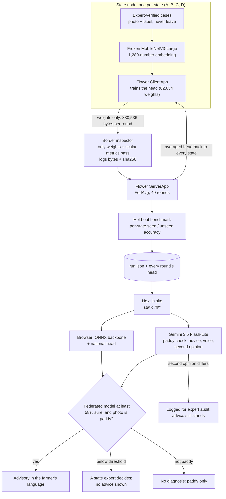

# Saajha (साझा)

**States share what they've learned — not who their farmers are.**

Saajha is a federated learning layer for India's agricultural digital public infrastructure. Every expert-verified crop diagnosis in one state becomes a model improvement for every state, and no farmer record crosses a state border.

Live: **shared layer** https://saajha-hub.vercel.app · **state node** https://saajha-node.vercel.app (Vercel, Mumbai region)

This repository holds two apps. **`apps/hub`** is the shared layer: the federation, the model evidence and the diagnosis gallery described below. **`apps/node`** is a state node: KisanVaani, the farmer layer (voice calls, SMS and WhatsApp in 12+ languages, expert escalation to RSKs/KVKs, crop recommendations and the district officer console), built by Team Vishwakarma Devs for Code for Communities Edition 1 and copied in as the starting point for the node (last Ed1 commit `56afafb`, 22 Jul 2026). Connecting the two is the work of this edition.

## Problem and solution

Agricultural data in India is held state by state, and India's data protection law (DPDPA 2023) makes pooling farmers' photos and records in one national store hard to justify. So a pest that one state's experts have diagnosed hundreds of times can still be unknown to the model another state uses. Saajha lets each state train a small crop-diagnosis model on its own expert-verified cases and send **only the model weights** to a national aggregator (Flower, FedAvg). The averaged model goes back to every state. The federated model decides the diagnosis: advice is shown when it is at least 58% sure (a threshold calibrated on held-out validation photos so that at least 90% of the advice given is right) and Gemini confirms the photo shows paddy. Below that threshold, a state expert decides and no advice is shown. Gemini writes the advice in the farmer's language from a cited reference card, speaks it, and gives a second opinion: when its label differs, the advice stands and the case is logged for a state expert to audit. Gemini does not decide because it is not reliable at telling these 10 field conditions apart: on 50 held-out photos from run `deploy-h64-r40`, `gemini-3.5-flash-lite` alone (zero-shot, limited to the 10 labels) named the right condition 24% of the time and stated about 92% confidence whether right or wrong, while the federated model was right on 84% of the same photos.

## Results

From recorded run **`deploy-h64-r40`** (exported 26 Sep 2026): a real Flower deployment with 1 SuperLink and 4 SuperNode processes, 40 rounds of FedAvg. Every figure below is copied from `apps/hub/public/fl/run.json`, which is where the site reads them. Accuracies are on 1,549 held-out photos that no state trained on.

| | Result |
|---|---|
| Federated model, all 10 conditions | **84.5%** |
| Same head trained on all four states' data pooled in one place (upper bound) | 88.8% |
| Each state trained alone | 51.5% to 64.2% |
| State C on the 4 conditions it has never recorded (incl. rice hispa): alone → federated | **0% → 82.1%** |
| Every state on the conditions it has never recorded: alone → federated | 0% → 77.1% to 87.9% |
| Hard subset (786 held-out photos with no near-twin in any training set): federated | 81.4% |
| Hard subset, State C on conditions it never recorded: alone → federated | 0% → 80.0% |
| Weights each state sends per round | 330,536 bytes |
| Raw farmer records that crossed a state border | **0**, in all 40 rounds |
| Gemini alone (`gemini-3.5-flash-lite`, zero-shot, 10 labels) vs federated, same 50 held-out photos | 24% vs 84% |

**Read this with the disclosures below:** states A–D are simulated, label-skewed partitions of one public Tamil Nadu dataset.

## Architecture



- **Frozen backbone, federated head.** Each state runs the same public image model (torchvision MobileNetV3-Large, IMAGENET1K_V2, frozen) and trains only a small MLP head on its 1,280-number embeddings (1280 → 64 → 10). Updates are 330 KB instead of a 16.8 MB model, so every round's real weights ship with the site and can be replayed.
- **Masked softmax for label skew.** A state leaves the conditions it holds no cases of out of its local loss, so a state with no hispa does not teach the shared model that hispa never happens.
- **Border inspector** (`fl/saajha_fl/inspector.py`). Every reply is checked before it is averaged; anything other than weights and scalar metrics raises and stops the round. Bytes are measured from the arrays, and a sha256 of each round's aggregated weights is recorded. The browser code and `check_contract.py` recompute the same hash.
- **Calibrated confidence and gate.** Each round's head gets a temperature fitted on a validation split. The federated answer counts as confident at ≥ 58% calibrated confidence (the lowest threshold with ≥ 90% precision on validation), and only then is advice shown. Gemini's stated confidence plays no part in the gate.

More detail, in plain language: the site's **Method and limits** page (`/method`).

## How Google AI is used

| Job | Model | Where |
|---|---|---|
| Checks an uploaded photo shows paddy (the federated model cannot tell a non-paddy photo), and gives a second-opinion label on the 10 classes (or "other / unsure") with confidence and visible symptoms | `gemini-3.5-flash-lite`; `gemini-3.1-flash-lite` after two 429/503 failures | `apps/hub/app/api/diagnose/route.ts` |
| Advisory in the farmer's language (12 languages), written from cited advisory cards (`apps/hub/lib/knowledge.json`) | `gemini-3.5-flash-lite` (same fallback) | `apps/hub/app/api/advisory/route.ts` |
| Spoken advisory | `gemini-3.8-flash-lite-tts`; the device voice if it fails | `apps/hub/app/api/tts/route.ts` |
| Second opinion, audited: Gemini's label never decides; when it differs from the federated model's, the advice stands and the case is logged for a state expert to audit | `gemini-3.5-flash-lite` | `apps/hub/lib/gate.ts` |
| Benchmark: Gemini alone vs the federated model on 50 held-out photos of run `deploy-h64-r40` (24% vs 84%; Gemini stated about 92% confidence whether right or wrong) | `gemini-3.5-flash-lite`, zero-shot, limited to the 10 labels | `fl/scripts/gemini_bench.py` → `gemini_benchmark` in `apps/hub/public/fl/run.json` |

If Gemini is unavailable (no key, quota, outage), `/api/diagnose` returns HTTP 503 with a plain error. It never returns a made-up diagnosis.

## What is real and what is not

**Real**
- Flower training and aggregation: a Flower deployment runtime, 1 SuperLink + 4 SuperNode processes, on one machine.
- Every weight file and its sha256: all 41 national heads (round 0 is the untrained start) and the 4 local-only heads, served as recorded.
- All accuracies, on a held-out benchmark no state trained on.
- The border inspector check: records moved = 0 in every round.
- Gemini calls on photos a visitor uploads.
- Browser inference with the same backbone file the states used.

**Simulated or seeded**
- States A–D are label-skewed partitions of one Tamil Nadu dataset (Paddy Doctor). They do not describe real pest prevalence in any state.
- "Expert-verified" labels are the dataset's own labels.
- The network is simulated: all nodes ran on one computer. No state runs a node.
- The site replays a recorded federation run; it does not train live.
- Gallery outputs may be pre-generated; where they are, they are dated.
- Escalation tickets stay in the visitor's browser; no expert or KVK receives them.
- Advisory cards are compiled from cited public sources (TNAU Agritech Portal, IRRI Rice Knowledge Bank, ICAR-NRRI and others) and have not been reviewed by an agronomist.
- There is no AgriStack or Kisan Sarathi integration. The design is built to sit on them.

## Known limits

- **One site, one season, one annotator.** Paddy Doctor photos come from a village near Tirunelveli, Tamil Nadu, taken February–April 2021 and labelled with the help of an agricultural officer ([dataset paper](https://arxiv.org/abs/2205.11108)).
- **Near-duplicate photos.** The dataset photographs the same plants repeatedly, which flatters a random split. The hard-subset rows above (held-out photos whose nearest training image has cosine similarity < 0.95) are the more honest numbers.
- **Paddy only, 10 conditions.** Anything else can only be flagged by Gemini as "other / unsure".
- **The frozen backbone caps accuracy** (88.8% pooled upper bound).
- **Simulated topology.** No real network latency, dropped nodes or version drift.
- **No differential privacy in this run.** Flower supports it on the updates; it is the next step.
- **Confidence is not correctness.** A calibrated 90% is still wrong one time in ten: below the threshold a state expert decides, and every differing Gemini second opinion is logged for expert audit.

## Repository layout

```
apps/hub/                Shared layer: this site (federation, model evidence, diagnosis gallery)
apps/node/               State node: KisanVaani (voice, SMS, WhatsApp, expert desk, officer console).
                         Copied from Code for Communities Ed. 1 (see NOTICE)
fl/                      Python: the Flower app and the offline pipeline
  pyproject.toml         Flower app config (40 rounds, lr 0.2, 2 local epochs, hidden 64, masked softmax)
  run_deployment.sh      SuperLink + 4 SuperNodes + `flwr run` (bash)
  run_deployment.ps1     the same, one visible window per process (Windows)
  saajha_fl/             common (classes, partition), backbone, task (head, training, eval),
                         client_app, server_app, inspector
  scripts/               prepare_data, embed, baseline_local, export_onnx, export_web,
                         check_contract, gemini_bench, flip_spike
apps/hub/ in detail       Next.js 16 app (App Router, React 19, Tailwind 4)
  app/                   / (the flip), /diagnose, /federation, /method, api/diagnose
  components/, lib/      UI; run.json types, browser head maths + sha256, ONNX loader, Gemini wrapper
  public/fl/             run.json, gallery.json, heads/*.json (every round's real weights)
  public/models/         backbone.onnx (frozen MobileNetV3-Large, 16.8 MB)
  public/gallery/        6 attributed sample photos from Paddy Doctor
```

## Reproduce

Python 3.13 and Node 20. The Flower simulation engine needs Ray, which flwr 1.37 does not support on Windows, so the run uses the deployment runtime everywhere.

**1. Get the data** (not in this repo; see licence note below). Either:
- Official: accept the rules of the Kaggle competition [paddy-disease-classification](https://www.kaggle.com/competitions/paddy-disease-classification), then `kaggle competitions download -c paddy-disease-classification` and unzip so that `$SAAJHA_DATA/kaggle/train_images/<label>/*.jpg` exists; or
- The Hugging Face parquet mirror of the same release that run `deploy-h64-r40` used ([anthony2261/paddy-disease-classification](https://huggingface.co/datasets/anthony2261/paddy-disease-classification), about 816 MB): put the `*.parquet` shards in `$SAAJHA_DATA/hf/`.

**2. Python environment**

```bash
python -m venv ~/venvs/saajha && source ~/venvs/saajha/bin/activate   # Windows: ...\Scripts\activate
pip install "flwr==1.37.0" torch torchvision numpy pandas pyarrow pillow onnx onnxscript onnxruntime google-genai python-dotenv
export SAAJHA_DATA=/path/to/saajha-data     # keep it outside any synced folder
export SAAJHA_VENV=~/venvs/saajha           # used by run_deployment.sh
```

`flwr run . local-deployment` needs a `local-deployment` connection in `~/.flwr/config.toml`. In flwr 1.37 the SuperLink's Control API listens on 127.0.0.1:8000; the connection this run used:

```toml
[superlink.local-deployment]
address = "127.0.0.1:8000"
insecure = true
```

**3. Pipeline** (from the repo root)

```bash
python fl/scripts/prepare_data.py                  # dedupe, hold out test/val, partition into states A-D
python fl/scripts/embed.py                         # frozen-backbone embeddings (+ mirrored views)
bash   fl/run_deployment.sh deploy-h64-r40         # SuperLink + 4 SuperNodes, 40 rounds of FedAvg
python fl/scripts/baseline_local.py --run deploy-h64-r40   # each state alone: the "before"
python fl/scripts/export_onnx.py                   # backbone -> apps/hub/public/models/backbone.onnx, parity check
python fl/scripts/export_web.py --run deploy-h64-r40       # run.json, every head, gallery -> apps/hub/public
python fl/scripts/check_contract.py                # zero records moved, every sha256 recomputes
```

**4. Web app**

```bash
cd apps/hub
cp .env.example .env.local      # then set GEMINI_API_KEY
npm install && npm run dev
```

Everything except the Gemini routes works without a key; without one, `/api/diagnose` returns 503.

## Environment variables

From `apps/hub/.env.example`. Never commit `.env.local`.

| Variable | Purpose |
|---|---|
| `GEMINI_API_KEY` | Google Gemini API key. Required for the Gemini routes. |
| `GEMINI_MODEL` | Paddy check, second opinion and advisory model (default `gemini-3.5-flash-lite`; fallback `gemini-3.1-flash-lite`). |
| `GEMINI_MODEL_FALLBACK` | Used after the primary fails twice with 429/503 (default `gemini-3.1-flash-lite`). |
| `GEMINI_TTS_MODEL` | Text-to-speech model for spoken advisories (default `gemini-3.8-flash-lite-tts`). |

Pipeline only: `SAAJHA_DATA` (data folder), `SAAJHA_VENV` (virtualenv for `run_deployment.sh`), `SAAJHA_EMB` (embedding cache name, default `emb`).

## Data licence

Paddy Doctor is CC BY 4.0 under the Kaggle competition rules §7A. §7B restricts redistributing the competition data, so this repository ships no dataset images except the six attributed samples in `apps/hub/public/gallery/`, and `.gitignore` excludes the data folder.

## Credits and licences

- **Paddy Doctor dataset:** Petchiammal A., Briskline Kiruba S., Murugan D., Pandarasamy Arjunan. "Paddy Doctor: A Visual Image Dataset for Automated Paddy Disease Classification and Benchmarking", [arXiv:2205.11108](https://arxiv.org/abs/2205.11108). 10-class labelled release from Kaggle [paddy-disease-classification](https://www.kaggle.com/competitions/paddy-disease-classification), CC BY 4.0 (rules §7A).
- **Backbone:** torchvision MobileNetV3-Large, IMAGENET1K_V2 weights (PyTorch and torchvision, BSD-3-Clause).
- **Federated learning:** [Flower](https://flower.ai) 1.37 (Apache-2.0).
- **Browser inference:** onnxruntime-web (MIT), loaded from jsDelivr.
- **Google Gemini API.**
- **Advisory sources:** TNAU Agritech Portal, IRRI Rice Knowledge Bank, ICAR-National Rice Research Institute, NCIPM / DPPQS Integrated Pest Management package for rice, and others; each card in `apps/hub/lib/knowledge.json` lists its sources.
- **KisanVaani** (`apps/node`): Team Vishwakarma Devs, Code for Communities Ed. 1, reused with the team's agreement. The hub's Gemini retry wrapper, 12-language prompt map, speech wrapper and diagnosis-route pattern were also adapted from it. See [NOTICE](NOTICE).
- **Adapted code:** Flower app layout and weights-only border inspector adapted from the author's SwasthSetu project, derived from Flower's quickstart-pytorch (Apache-2.0).
- **Web and type:** Next.js, React, Tailwind CSS (MIT); Anek typeface by Ek Type via Google Fonts (SIL Open Font License 1.1).

Licensed under [Apache-2.0](LICENSE). Copyright 2026 Aditya Singh; KisanVaani (`apps/node`) copyright 2026 Team Vishwakarma Devs. See [NOTICE](NOTICE).

Built for Build with AI: Code for Communities, Second Edition (Google Cloud × Hack2skill × GDG India), track PS-04 Agricultural Intelligence.
